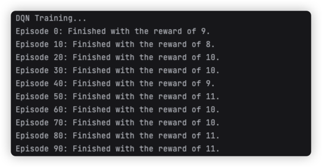
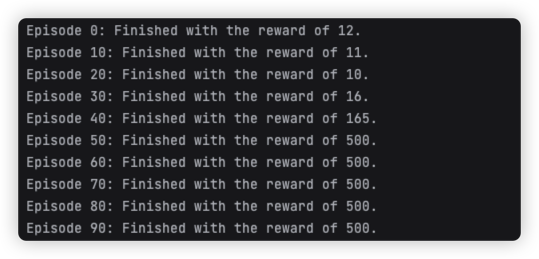
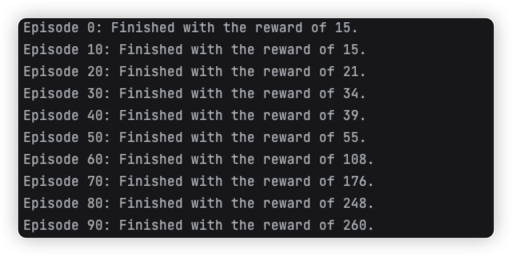
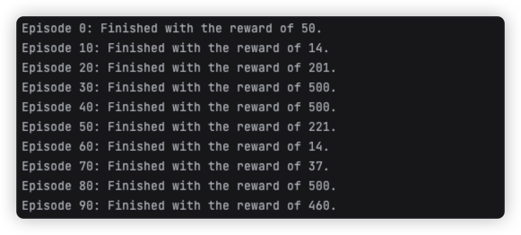
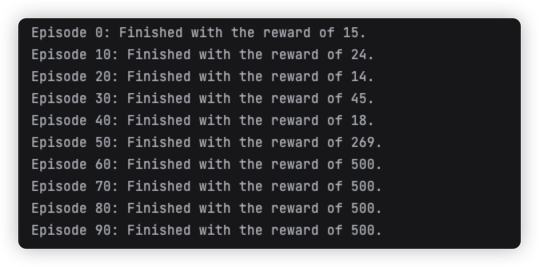
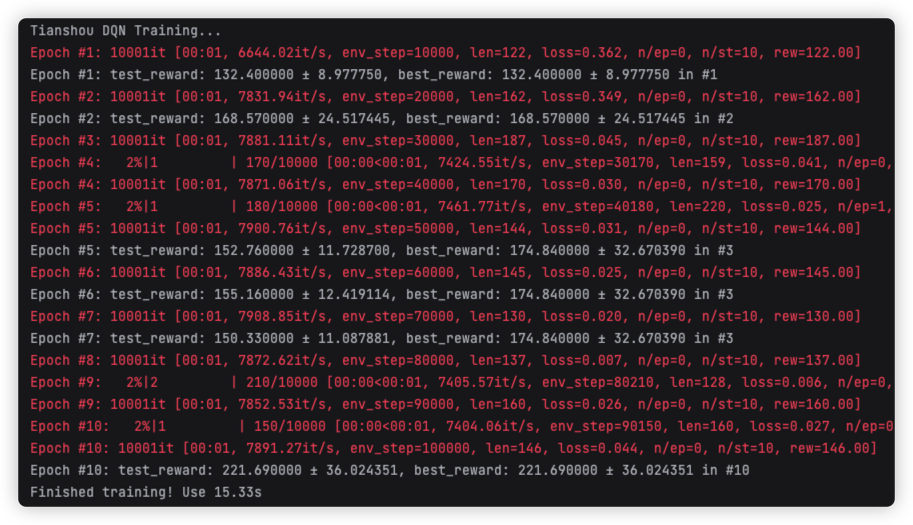

# AIintro_TermProject2
TCY 2023春季学期 人工智能导论大作业2 使用强化学习算法自动玩一个游戏

## 代码结构介绍与运行方法

代码中`models/*`文件夹下为各模型的实现，`main.py`中分别包含了DQN、PETS算法，以及利用Tianshou库实现DQN算法的训练主函数。

要安装代码运行所需的依赖文件，请使用：
```bash
pip install -r requirement.txt
```

要运行测试的模块，请使用：
```bash
python main.py
```


## 实验报告
**由于本次实验项目均在同一仓库中实现，因此报告也在readme文件中呈现。**

### 0. 背景介绍

就当前强化学习的发展来看，强化学习算法主要包含Model-based与Model-free方法。


*图片来自OpenAI Spinning Up, https://spinningup.openai.com/en/latest/*

Model-free方法通过优化策略函数，直接从环境中学习到策略函数的最优解，而Model-based方法则通过学习环境的模型，再通过模型预测的方法来优化策略函数。

其中，Model-free模型又主要包含Policy Gradient、Q-Learning、Actor-Critic的方法，
当前Q-Learning多使用神经网络学习价值函数，通过给各动作打分的形式选择动作；Policy Gradient则直接学习策略函数，输出各动作的概率；
而Actor-Critic则同时学习策略函数与价值函数，通过决策-打分的方法共同促进模型的训练。


### 1. 实验内容概述

模型上，我们选择构建了Model-free方法中的DQN算法、Model-base方法中的PETS算法。

在游戏选择上，我们选择了提供标准接口的OpenAI Gym环境进行尝试。

我们构建了模型并对它们进行训练，探究了不同模型、参数设置与数据处理方式对模型训练效果的影响。

最后，为了说明当前强化学习环境与模型库的完善性，我使用`Tianshou`平台中的Double DQN模型，对`OpenAI Gym`中的`CartPole-v1`环境进行了训练，
使用极为简单的代码即完成了高效的模型构建与训练。

### 2. 实验过程与结果分析

实验中，我们使用了OpenAI Gym中的`CartPole-v1`环境进行了实验。

`CartPole`环境的动作空间为控制小车的左右移动，目标为使小车上的杆不倒下。

此外，每次环境更新会返回杆的水平方向位置与速度、转动的角度与角速度作为环境状态，
当游戏还没结束时均返回1作为奖励。


#### 2.1 DQN

DQN是基于Model-free方法的强化学习算法，其主要思想是通过神经网络学习价值函数，通过给各动作打分的形式选择动作。

为达到较为可用的模型训练效果，实验中我们构建Double DQN（即另有一个Target Net用于定期更新参数）。

DQN模型的实现详见`models/dqn.py`。

主要分为以下几个部分：

1. 神经网络部分：

在实验中我们通过定义该类实现。

```python
class Net(nn.Module):
    def __init__(self, state_shape, action_shape):
        super(Net, self).__init__()
        self.fc1 = nn.Linear(state_shape, 50)
        self.fc1.weight.data.normal_(0, 0.1)   # initialization
        self.out = nn.Linear(50, action_shape)
        self.out.weight.data.normal_(0, 0.1)   # initialization

    def forward(self, x):
        x = self.fc1(x)
        x = F.relu(x)
        actions_value = self.out(x)
        return actions_value
```

类继承自`torch.nn`为全连接层，用于动作的打分。

2. 在类`DQN`中，我们定义了具体如何选择动作:
   
```python
def choose_action(self, x):
    x = torch.unsqueeze(torch.FloatTensor(x), 0)
    # input only one sample
    if np.random.uniform() < self.epsilon:   # greedy
        actions_value = self.eval_net.forward(x)
        action = torch.max(actions_value, 1)[1].data.numpy()
        action = action[0]  # return the argmax index
    else:   # random
        action = np.random.randint(0, self.n_actions)
        action = action
    return action
```

3. 如何更新网络：
```python
def learn(self):
    # target parameter update
    if self.learn_step_counter % self.target_replace_iter == 0:
        self.target_net.load_state_dict(self.eval_net.state_dict())
    self.learn_step_counter += 1

    # sample transitions (size: batch_size) from memory pool
    sample_index = np.random.choice(self.memory_capacity, self.batch_size)
    b_memory = self.memory[sample_index, :]
    b_s = torch.FloatTensor(b_memory[:, :self.n_states])
    b_a = torch.LongTensor(b_memory[:, self.n_states:self.n_states+1].astype(int))
    b_r = torch.FloatTensor(b_memory[:, self.n_states+1:self.n_states+2])
    b_s_ = torch.FloatTensor(b_memory[:, -self.n_states:])

    # q_eval w.r.t the action in experience
    q_eval = self.eval_net(b_s).gather(1, b_a)  # shape (batch, 1)
    q_next = self.target_net(b_s_).detach()     # detach from graph, no backpropagation
    q_target = b_r + self.gamma * q_next.max(1)[0].view(self.batch_size, 1)   # shape (batch, 1)
    loss = self.loss_func(q_eval, q_target)

    self.optimizer.zero_grad()
    loss.backward()
    self.optimizer.step()
```

4. 如何利用储存经验用于经验回放：
```python
def store_transition(self, s, a, r, s_):
    # store the transition in memory pool, called after env.step()
    transition = np.hstack((s, [a, r], s_))
    # replace the old memory with new memory
    index = self.memory_counter % self.memory_capacity
    self.memory[index, :] = transition
    self.memory_counter += 1
```
5. 此外还有如`epsilon`贪婪策略等。


在本项实验中，我们发现了在默认的奖励下模型训练的困难之处。

`CartPole-v1`环境中，默认在游戏结束前每一步的奖励为1，这样的奖励方式让智能体不能高效评判每步动作的好坏，训练较为困难。

使用DQN在默认的奖励下训练结果如下：



可以看到，模型得到奖励的提升较为不明显。


而基于这样的问题，我们可以根据环境的状态认为加入对模型奖励的修改，从而促进模型收敛在效果较好的位置。

我们尝试根据返回状态中杆的位置与角度调整了奖励：

```python
    x, x_dot, theta, theta_dot = next_obs
    r1 = (x_threshold - abs(x)) / x_threshold - 0.8
    r2 = (theta_threshold_radians - abs(theta)) / theta_threshold_radians - 0.5
    reward = r1 + r2
```

在其他参数相同的情况下，模型训练效果如下：



可以看到，模型的训练效果已经显著提升，并可以达到接近最优的效果。

#### 2.2 PETS

PETS算法是基于模型的强化学习算法，其主要思想是通过学习环境的模型，再通过模型预测的方法来优化策略函数。

相较于Model-free的方法，基于模型的方法一般被认为学习所需要的采样次数更少，但是其模型的学习过程也会带来额外的计算开销。

实验中发现，相比于DQN方法，PETS的计算效率显著更低，且效果上相比于DQN也没有明显的提升。

PETS模型的实现详见`models/pets.py`。

在构建上，模型采用了EnsembleModel的方法用于多个相同网络的同时训练，用于提高模型训练的准确性。

具体实现上由于较为复杂，报告中不做一一展示，如下为最外层的训练得到的估计环境：
```python
class FakeEnv:
    def __init__(self, model):
        self.model = model

    def step(self, obs, act):
        inputs = np.concatenate((obs, act), axis=-1)
        ensemble_model_means, ensemble_model_vars = self.model.predict(inputs)
        ensemble_model_means[:, :, 1:] += obs.numpy()
        ensemble_model_stds = np.sqrt(ensemble_model_vars)
        ensemble_samples = ensemble_model_means + np.random.normal(
            size=ensemble_model_means.shape) * ensemble_model_stds

        num_models, batch_size, _ = ensemble_model_means.shape
        models_to_use = np.random.choice(
            [i for i in range(self.model._num_network)], size=batch_size)
        batch_inds = np.arange(0, batch_size)
        samples = ensemble_samples[models_to_use, batch_inds]
        rewards, next_obs = samples[:, :1], samples[:, 1:]
        return rewards, next_obs

    def propagate(self, obs, actions):
        with torch.no_grad():
            obs = np.copy(obs)
            total_reward = np.expand_dims(np.zeros(obs.shape[0]), axis=-1)
            obs, actions = torch.as_tensor(obs), torch.as_tensor(actions)
            for i in range(actions.shape[1]):
                # action = torch.unsqueeze(actions[:, i], 1)
                action = actions[:, i, :]
                rewards, next_obs = self.step(obs, action)
                total_reward += rewards
                obs = torch.as_tensor(next_obs)
            return total_reward
```


而在动作选择上，PETS模型采用了planning的方法根据当前状态估计各动作序列的奖励值，再选择奖励值最大的动作序列作为最终的动作。

```python
def optimize(self, state):
    # Generate all possible sequences
    mesh = np.meshgrid(*[np.arange(self.action_space) for _ in range(self.sequence_length)])
    current_sequence = np.column_stack([x.flat for x in mesh])
    state = np.tile(state, (self.action_space**self.sequence_length, 1))
    all_sequences_onehot = np.eye(self.action_space)[current_sequence]
    returns = self.fake_env.propagate(state, all_sequences_onehot)[:, 0]
    return current_sequence[np.argmax(returns)]
```


本项实验中，我们对`learning rate`的设置对模型的影响进行了探究。

我们发现，当`learning rate`过小时，模型的训练效果增长较为稳定，但提升效率较慢，所需的训练时间与次数更多。



*PETS模型 lr=0.0001情况下的训练表现*

而当`learning rate` 较大时，模型的训练效果增长较快，但是模型的训练效果较为不稳定，即使在某些轮试验中已经达到了最佳的训练效果，
在一些时候模型效果还会随着训练的进行而再次下降。


*PETS模型 lr=0.001情况下的训练表现*

只有`learning rate`在一定范围内，模型的训练效果才会较为稳定，且训练效率较高。


最终，我们找到的较理想的模型参数如下：
```json
{
    'memory_capacity': 2000,
    'sequence_length': 5,
    'num_network': 5,
    'lr': 0.0003,
    'train_iter': 100,
}
```
训练结果如下：



#### 2.3 Tianshou DQN

Tianshou（天授）是一个纯基于PyTorch实现的强化学习模型平台，其内部汇集了Model-free、Model-based、Multi-agent等多种强化学习算法，
并且提供了完善的模型接口，可以方便地进行模型的构建、训练与测试。

除了进行了封装的`Policy`与`Network`，`Tianshou`还提供了`Collector`、`Logger`、`trainer`等多种工具，可以方便地进行模型的训练参数控制与结果输出。

在本次实验中，我使用Tianshou中的DQN模型，对OpenAI Gym中的`CartPole-v1`环境进行了训练。

```python
    task = 'CartPole-v1'
    lr, epoch, batch_size = 1e-3, 10, 64
    train_num, test_num = 10, 100
    gamma, n_step, target_freq = 0.9, 3, 320
    buffer_size = 20000
    eps_train, eps_test = 0.1, 0.05
    step_per_epoch, step_per_collect = 10000, 10

    train_envs = ts.env.DummyVectorEnv([lambda: gym.make(task) for _ in range(train_num)])
    test_envs = ts.env.DummyVectorEnv([lambda: gym.make(task) for _ in range(test_num)])

    env = gym.make(task)
    state_shape = env.observation_space.shape or env.observation_space.n
    action_shape = env.action_space.shape or env.action_space.n

    net = Net(state_shape=state_shape, action_shape=action_shape, hidden_sizes=[128, 128, 128])
    optim = torch.optim.Adam(net.parameters(), lr=lr)

    policy = ts.policy.DQNPolicy(net, optim, gamma, n_step, target_update_freq=target_freq)
    train_collector = ts.data.Collector(policy, train_envs, ts.data.VectorReplayBuffer(buffer_size, train_num),
                                        exploration_noise=True)
    test_collector = ts.data.Collector(policy, test_envs,
                                       exploration_noise=True)  # because DQN uses epsilon-greedy method

    result = ts.trainer.offpolicy_trainer(
        policy, train_collector, test_collector, epoch, step_per_epoch, step_per_collect,
        test_num, batch_size, update_per_step=1 / step_per_collect,
        train_fn=lambda epoch, env_step: policy.set_eps(eps_train),
        test_fn=lambda epoch, env_step: policy.set_eps(eps_test),
        stop_fn=lambda mean_rewards: mean_rewards >= env.spec.reward_threshold)
    print(f'Finished training! Use {result["duration"]}')
```
训练结果如下：



可以看到，仅使用约30行代码，我们就实现了模型的构建与训练的过程，且由于Tianshou对模型与训练过程的优化。训练速度非常快。

但同时，由于对模型与训练过程的封装，我们对训练过程的控制会稍有困难，例如前面模型中对reward的修改就不易实现。

### 3. 实验总结

在本次实验中，我对强化学习的基本概念进行了学习，并实现的强化学习的一些基本算法与模型调节，进行了其在简单游戏上的训练。

实验发现，不同模型的训练效率与结果不同，在动作、状态空间较简单的`CartPole`环境中，Model-free的方法
与Model-based方法在模型训练准确度与训练要求的数据量上差异不大，但Model-based方法在训练速度上要显著慢于Model-free方法。

而对于模型在默认状态下训练效果不佳的问题，我们尝试利用环境状态修改环境的奖励，达到了提高模型训练效果的目的。

此外，我们发现对模型而言，过小、过大的学习率都会影响训练的效果，只有在合适的学习率下，模型才能够较好地进行训练。

### 4. 参考列表

**在本次实验中，我参考了以下网络资料：**

- [1] **动手学强化学习-模型预测控制**, https://hrl.boyuai.com/chapter/3/模型预测控制/
- [2] **蘑菇书EasyRL**, https://datawhalechina.github.io/easy-rl/#/
- [3] **莫烦Python-PyTorch-DQN强化学习**, https://mofanpy.com/tutorials/machine-learning/torch/DQN
- [4] **OpenAI Spinning Up**, https://spinningup.openai.com/en/latest/

**在本次实验中，我参考了以下文章：**

- [1] Brockman, Greg, et al. "**Openai gym.**" arXiv preprint arXiv:1606.01540 (2016).
- [2] Mnih, Volodymyr, et al. "**Playing atari with deep reinforcement learning.**" arXiv preprint arXiv:1312.5602 (2013).
- [3] Chua, Kurtland, et al. "**Deep reinforcement learning in a handful of trials using probabilistic dynamics models.**" Advances in neural information processing systems 31 (2018).
- [4] Weng, Jiayi, et al. "**Tianshou: A highly modularized deep reinforcement learning library.**" arXiv preprint arXiv:2107.14171 (2021).
